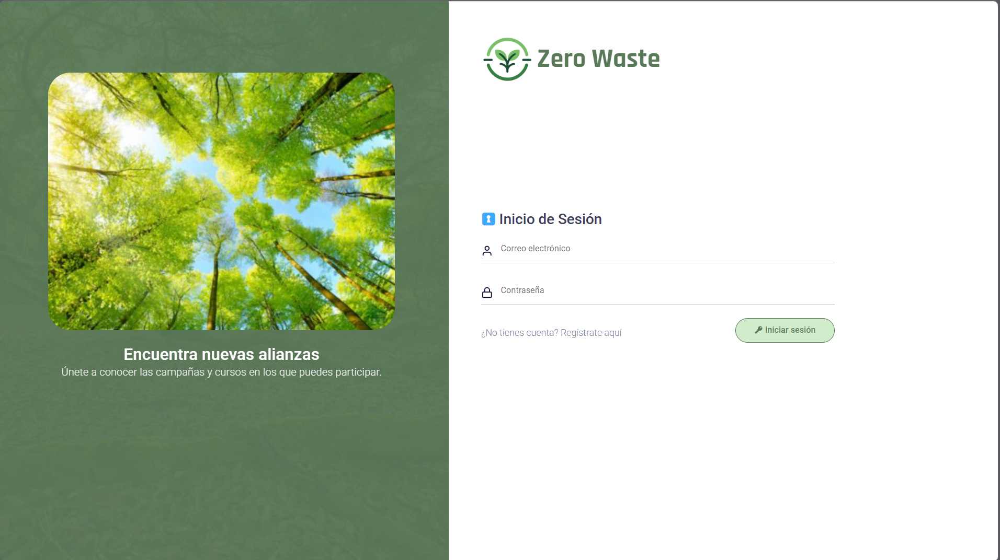

# 🌱 Zero Waste – Educational Sustainability Platform

Zero Waste is a web-based educational platform designed to promote environmental awareness through structured learning resources. The platform allows users to access educational content, read blog articles, enroll in courses, complete reading materials in PDF format, and take a final exam to obtain certification.

The application is built using **Python and Flask**, implementing authentication, database management, and course content delivery.

---

## 📌 Project Overview

The platform provides an integrated environment where users can:

- Create an account and authenticate securely  
- Access educational blog posts related to sustainability  
- Enroll in structured courses  
- Read course chapters in PDF format  
- Complete a final exam with limited attempts  
- Receive certification after successfully passing the exam  

This project was developed as part of an educational initiative to demonstrate the integration of backend development, database design, and web interface implementation.

---

## 🚀 Features

### User Authentication
Users can register, log in, and manage sessions securely.

### Blog System
Administrators can publish sustainability-related articles that users can read.

### Course Platform
Courses include structured chapters containing PDF learning materials.

### Final Exam System
Each course includes a final assessment with limited attempts.

### Certification
Users who successfully pass the exam receive course completion recognition.

### File Upload System
Course creators can upload images and PDF documents.

---

## ⚙️ Tech Stack

### Backend
- Python
- Flask
- SQLAlchemy

### Frontend
- HTML
- CSS

### Database
- SQLite (development)

---

## 📂 Project Structure

```
zero-waste-flask-platform
│
├── static/                # CSS, images and uploaded files
├── templates/             # HTML templates for the application
│
├── app.py                 # Main Flask application
├── models.py              # Database models
├── creacurso.py           # Course creation logic
├── insertar_posts.py      # Blog post management
├── make_admin.py          # Script to create an administrator
├── requirements.txt       # Python dependencies
│
└── README.md
```

---

## 💻 Installation

Clone the repository:

```bash
git clone https://github.com/yourusername/zero-waste-flask-platform.git
```

Navigate to the project directory:

```bash
cd zero-waste-flask-platform
```

Install dependencies:

```bash
pip install -r requirements.txt
```

Run the application:

```bash
python app.py
```

The application will start locally.

---

## 📸 Screenshots

- Login page


- Course view  
- Course chapters  
- Final exam  

Example format:


---

## 🔮 Future Improvements

Possible future enhancements include:

- Course progress tracking  
- Improved certificate generation system  
- Role-based permissions for instructors  
- Deployment with Docker  
- Integration with cloud storage for course materials  

---

## 👨‍💻 Author

**Saúl Alejandro Chávez Guzmán**

Backend developer in training with experience in:

- Database design
- Flask backend development
- SQL and data management
